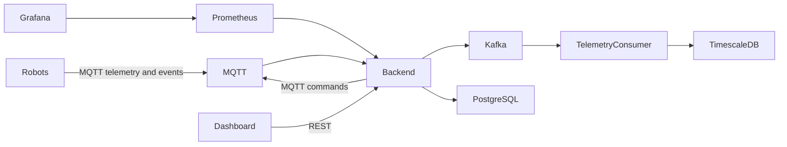

## Persistent local data

Docker Compose stateful services use host folders under `data/` so container stop/start and rebuild cycles do not erase local state:

- `data/postgres/` for PostgreSQL / TimescaleDB (Postgres stores its cluster in `data/postgres/data/`);
- `data/mqtt/` for Mosquitto persistence;
- `data/kafka/` for Kafka log segments;
- `data/prometheus/` for Prometheus TSDB data;
- `data/grafana/` for Grafana dashboards, users, and provisioning state;
- `data/robots/robot-01/`, `data/robots/robot-02/`, `data/robots/robot-03/` for simulator command-history files.

Use this as the initial instruction for GitHub Copilot in the new repository.

# Task: Create the initial Robot Fleet learning project

Create a minimal but working repository for a robot fleet-management platform.

This repository is intended for hands-on learning and will be gradually extended during a crash course covering:

* robot-to-cloud communication;
* MQTT;
* Kafka;
* PostgreSQL and TimescaleDB;
* Rust backend development;
* command delivery and acknowledgements;
* telemetry ingestion;
* observability;
* Grafana dashboards;
* Docker Compose;
* robot fleet architecture.

Do not build a production-ready platform yet. Create the smallest understandable foundation that can run locally and be extended step by step.

## Main requirements

The project must contain:

* a backend written in Rust;
* PostgreSQL with the TimescaleDB extension;
* Kafka;
* an MQTT broker;
* Prometheus;
* Grafana;
* simple simulated robot instances;
* Docker Compose configuration;
* a Makefile for common development commands.

Each major component must be placed in its own folder.

## Repository structure

Create a structure similar to:

```text
robot-fleet/
├── backend/
│   ├── Cargo.toml
│   ├── Dockerfile
│   ├── migrations/
│   └── src/
├── robot-simulator/
│   ├── Cargo.toml
│   ├── Dockerfile
│   └── src/
├── infrastructure/
│   ├── postgres/
│   │   └── init/
│   ├── kafka/
│   ├── mqtt/
│   │   └── mosquitto.conf
│   ├── prometheus/
│   │   └── prometheus.yml
│   └── grafana/
│       ├── provisioning/
│       └── dashboards/
├── docker-compose.yml
├── Makefile
├── .env.example
├── .gitignore
└── README.md
```

Minor changes to this structure are acceptable when technically justified, but keep every major component isolated in its own folder.

## Rust backend

Use stable Rust.

Use a simple and common stack:

* Axum for HTTP;
* Tokio for async execution;
* SQLx for PostgreSQL access;
* Serde for JSON;
* tracing and tracing-subscriber for logging;
* Prometheus-compatible metrics;
* UUID command and event identifiers.

The backend must expose:

```http
GET /health
GET /robots
GET /robots/{robot_id}
POST /robots/{robot_id}/commands
GET /robots/{robot_id}/commands
GET /metrics
```

The initial implementation may be intentionally simple.

## Initial database model

Create SQLx migrations for the following tables.

### robots

Suggested fields:

```text
robot_id
name
status
battery_level
current_mission
last_seen_at
software_version
created_at
updated_at
```

### commands

Suggested fields:

```text
command_id
robot_id
command_type
payload
status
created_at
expires_at
acknowledged_at
completed_at
```

Use JSONB for the command payload.

Use command statuses such as:

```text
created
sent
acknowledged
running
completed
failed
expired
```

### command_events

Suggested fields:

```text
event_id
command_id
robot_id
event_type
payload
occurred_at
```

### telemetry

Suggested fields:

```text
robot_id
recorded_at
battery_level
temperature
position_x
position_y
payload
```

Convert the telemetry table into a TimescaleDB hypertable using `recorded_at` as the time column.

Keep current robot state in the `robots` table.

Keep historical telemetry in the `telemetry` hypertable.

## MQTT

Use Eclipse Mosquitto unless there is a strong reason to choose another lightweight MQTT broker.

Define topics similar to:

```text
robots/{robot_id}/telemetry
robots/{robot_id}/state
robots/{robot_id}/events
robots/{robot_id}/commands
robots/{robot_id}/command-results
```

For the first version:

* robot simulators publish telemetry and state through MQTT;
* robot simulators subscribe to their command topic;
* the backend subscribes to robot telemetry and state topics;
* the backend publishes commands to robot command topics.

Use QoS 0 for high-frequency telemetry.

Use QoS 1 for commands, command results and important state events.

Do not claim end-to-end exactly-once delivery. Use unique identifiers and idempotent processing.

## Kafka

Kafka must be included in Docker Compose, but keep its initial use minimal.

Use Kafka as an internal event stream after MQTT ingestion.

Create initial topics such as:

```text
robot-telemetry
robot-state-events
robot-command-events
robot-emergency-events
```

The expected flow is:

```text
Robot
  -> MQTT
  -> Rust backend ingestion
  -> Kafka
  -> consumers
  -> PostgreSQL or TimescaleDB
```

For the first implementation, it is acceptable for the backend to both publish to Kafka and persist directly to PostgreSQL, provided this temporary simplification is clearly documented.

Keep emergency events separate from normal telemetry.

## Robot simulator

Create a small Rust robot simulator.

It must support running multiple robot instances.

Each robot must have:

```text
robot_id
name
battery level
position
online/offline state
current mission
software version
```

The simulator should:

* connect to MQTT;
* publish telemetry periodically;
* publish a heartbeat or state message;
* subscribe to its command topic;
* acknowledge received commands;
* simulate command execution;
* publish command status changes;
* decrease battery level gradually;
* support temporary offline simulation;
* reconnect automatically;
* keep a small persistent local record of processed command IDs.

The simulator does not need realistic robot physics.

A simple command-line option or environment variable should define:

```text
ROBOT_ID
ROBOT_NAME
TELEMETRY_INTERVAL
MQTT_URL
```

Docker Compose should start at least three robot instances.

Example robots:

```text
robot-01
robot-02
robot-03
```

## Monitoring

Prometheus must scrape:

* backend metrics;
* simulator metrics where practical.

Expose initial metrics such as:

```text
robots_online
robot_messages_received_total
robot_telemetry_received_total
commands_created_total
commands_completed_total
command_failures_total
mqtt_connection_status
telemetry_ingestion_lag_seconds
backend_http_requests_total
```

Grafana must be provisioned automatically.

Create one minimal dashboard containing:

* number of online robots;
* telemetry message rate;
* commands created;
* commands completed;
* command failures;
* backend request rate;
* telemetry ingestion lag.

Do not spend excessive time on dashboard styling.

## Docker Compose

The complete platform must run with Docker Compose.

Include services for:

```text
backend
robot-01
robot-02
robot-03
postgres-timescaledb
mqtt
kafka
prometheus
grafana
```

Add Kafka dependencies required by the selected Kafka image.

Prefer a modern Kafka setup that does not require ZooKeeper when practical.

Add:

* named volumes;
* health checks;
* service dependencies;
* clear container names;
* environment variables;
* restart policies suitable for local development.

Do not store secrets directly in committed files.

Provide `.env.example`.

## Local development

The backend and robot simulator must also be runnable directly on the developer machine in debug mode while infrastructure runs in Docker.

The Makefile must include commands similar to:

```makefile
help
infra-up
infra-down
infra-logs
db-migrate
backend-run
backend-test
robot-run
dev
build
test
docker-build
docker-up
docker-down
docker-logs
clean
```

Expected behaviour:

```text
make infra-up
```

Starts PostgreSQL, TimescaleDB, MQTT, Kafka, Prometheus and Grafana.

```text
make backend-run
```

Runs the Rust backend locally in debug mode.

```text
make robot-run ROBOT_ID=robot-local
```

Runs one robot simulator locally.

```text
make dev
```

Starts the complete development environment using a reasonable combination of local processes and Docker infrastructure. Document the exact behaviour.

```text
make docker-up
```

Builds and starts the entire platform in containers.

## Configuration

Use environment variables for configuration.

Backend configuration should include:

```text
DATABASE_URL
MQTT_URL
KAFKA_BROKERS
RUST_LOG
HTTP_PORT
```

Robot configuration should include:

```text
ROBOT_ID
ROBOT_NAME
MQTT_URL
TELEMETRY_INTERVAL_SECONDS
RUST_LOG
```

Provide sensible defaults for local Docker Compose execution.

## Logging and error handling

Use structured logging with `tracing`.

Every important log should include relevant identifiers where available:

```text
robot_id
command_id
event_id
mission_id
```

Do not use `unwrap()` in normal runtime paths.

Return meaningful errors.

The system should wait for or retry connections to PostgreSQL, MQTT and Kafka during local startup instead of exiting immediately because another container is still starting.

## Tests

Add a minimal test foundation.

Include at least:

* backend health endpoint test;
* command creation test;
* command status transition test;
* duplicate command handling test for the robot simulator;
* one database integration test if practical.

Do not create an excessive test framework at this stage.

## README

Create a clear README containing:

1. project purpose;
2. architecture overview;
3. repository structure;
4. prerequisites;
5. local debug workflow;
6. Docker Compose workflow;
7. Makefile commands;
8. service URLs;
9. sample API requests;
10. MQTT topics;
11. current limitations;
12. planned course extensions.

Include a simple architecture diagram using Mermaid:



Document expected local URLs, for example:

```text
Backend:    http://localhost:8089
Grafana:    http://localhost:3000
Prometheus: http://localhost:9090
MQTT:       localhost:1883
PostgreSQL: localhost:5432
```

## Initial implementation boundaries

Keep the first version intentionally small.

Do not add yet:

* Kubernetes manifests;
* Helm charts;
* Terraform;
* authentication;
* authorisation;
* production TLS;
* advanced mission scheduling;
* a real frontend;
* full event sourcing;
* schema registry;
* production Kafka tuning;
* complex domain-driven design;
* multiple backend microservices.

Leave clear extension points for these topics.

## Code quality

Prefer straightforward code over abstraction.

Avoid unnecessary traits, generic frameworks or complex module structures.

The project should be understandable by an experienced C#, Go and TypeScript developer who is learning Rust and robotics architecture.

Add comments only where they explain an architectural or Rust-specific decision.

## Completion criteria

The initial task is complete when:

1. `make docker-up` starts the whole environment;
2. three simulated robots connect through MQTT;
3. robots publish telemetry;
4. the backend stores current robot state in PostgreSQL;
5. historical telemetry is stored in TimescaleDB;
6. the backend can create a command through REST;
7. the command is delivered to the correct robot;
8. the robot acknowledges and completes the command;
9. command status is visible through the backend API;
10. Prometheus collects backend metrics;
11. Grafana displays the initial dashboard;
12. the README explains how to run and inspect everything.

Implement this incrementally.

Start by creating the repository structure, Docker Compose infrastructure, database migrations, minimal backend health endpoint and one working robot simulator. Then add command handling, persistence, Kafka integration and monitoring.

After implementation, provide:

* a summary of created files;
* exact commands to run the project;
* known limitations;
* recommended next learning step.

One practical adjustment: allow Copilot to introduce Kafka after the basic MQTT-to-PostgreSQL flow works. This keeps the first runnable milestone small without removing Kafka from the target architecture.
