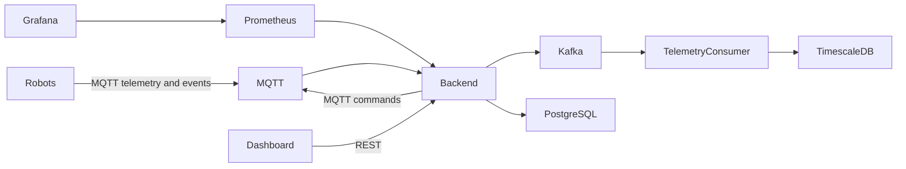

# Robot Fleet

Robot Fleet is a small learning project for building a robot fleet-management platform one piece at a time. It includes a Rust backend, simulated robots, MQTT, Kafka, PostgreSQL with TimescaleDB, Prometheus, Grafana, Docker Compose, and a Makefile.

The first version intentionally favors readability over production completeness.

## Architecture



Current implementation: the backend subscribes to robot MQTT telemetry/state/result topics, stores current robot state in PostgreSQL, stores historical telemetry in a TimescaleDB hypertable, exposes REST APIs, and publishes commands with unique IDs to robot MQTT command topics. Each robot persists processed command IDs for idempotency, so duplicate MQTT deliveries are ignored. Kafka is included and represented by a backend publishing hook; direct Kafka producer integration is a planned next step.

## Repository structure

```text
backend/                 Rust Axum API, SQLx migrations, MQTT ingestion
robot-simulator/         Rust MQTT robot simulator
infrastructure/mqtt/     Mosquitto config
infrastructure/prometheus/
infrastructure/grafana/  Provisioned datasource and dashboard
data/                    Persistent local Docker data
docker-compose.yml       Local platform
Makefile                 Developer commands
.env.example             Example configuration
```

## Prerequisites

- Docker and Docker Compose
- Rust stable
- `cargo install sqlx-cli --no-default-features --features postgres` for `make db-migrate`

## Local debug workflow

Start infrastructure:

```sh
make infra-up
```

Run the backend locally:

```sh
make backend-run
```

Run one simulator locally:

```sh
make robot-run ROBOT_ID=robot-local ROBOT_NAME="Local Robot"
```

Prometheus scrapes the local backend at `host.docker.internal:8089` and one local simulator at `host.docker.internal:9100`.

For local simulator runs, processed command IDs are stored in `data/robots/<ROBOT_ID>/processed_commands.txt`. Docker simulators store the same idempotency state under their mounted `/state` volume.

`make dev` starts Docker infrastructure and then runs the backend locally in the foreground. Start local robot simulators in separate terminals.

`make db-migrate` starts `postgres-timescaledb` if needed, waits for it to become ready, and then runs SQLx migrations against the local database port.

## Docker Compose workflow

Start the full platform with three robot simulators:

```sh
make docker-up
```

Inspect logs:

```sh
make docker-logs
```

Stop it:

```sh
make docker-down
```

Stateful container data is stored in `data/` on the host:

- `data/postgres/`
- `data/mqtt/`
- `data/kafka/`
- `data/prometheus/`
- `data/grafana/`
- `data/robots/robot-01/`
- `data/robots/robot-02/`
- `data/robots/robot-03/`

Each robot directory contains `processed_commands.txt`, which stores command UUIDs the simulator has already handled. This makes command handling idempotent across duplicate MQTT deliveries and simulator restarts.

## Makefile commands

```text
make help
make infra-up
make infra-down
make infra-logs
make db-migrate
make backend-run
make backend-test
make robot-run ROBOT_ID=robot-local
make dev
make build
make test
make docker-build
make docker-up
make docker-down
make docker-logs
make clean
```

## Service URLs

```text
Backend:    http://localhost:8089
Grafana:    http://localhost:3000  admin/admin
Prometheus: http://localhost:9090
MQTT:       localhost:1883
PostgreSQL: localhost:5432
Kafka:      localhost:9092
```

## API examples

```sh
curl http://localhost:8089/health
curl http://localhost:8089/robots
curl http://localhost:8089/robots/robot-01
curl http://localhost:8089/robots/robot-01/commands
curl -X POST http://localhost:8089/robots/robot-01/commands \
  -H 'content-type: application/json' \
  -d '{"command_type":"dock","payload":{"station":"A"}}'
```

The backend assigns every command a unique `command_id`. Robots persist completed command IDs and ignore repeated deliveries of the same ID.

## MQTT topics

```text
robots/{robot_id}/telemetry       QoS 0
robots/{robot_id}/state           QoS 1
robots/{robot_id}/events          reserved
robots/{robot_id}/commands        QoS 1
robots/{robot_id}/command-results QoS 1
```

Command messages sent by the backend to `robots/{robot_id}/commands` include the backend-generated ID:

```json
{
  "command_id": "uuid",
  "robot_id": "robot-01",
  "command_type": "dock",
  "payload": { "station": "A" }
}
```

## Configuration

Copy `.env.example` to `.env` for local overrides. Main variables:

```text
DATABASE_URL
MQTT_URL
KAFKA_BROKERS
RUST_LOG
HTTP_PORT
ROBOT_ID
ROBOT_NAME
TELEMETRY_INTERVAL_SECONDS
METRICS_PORT
PROCESSED_COMMANDS_PATH
```

## Current limitations

- No authentication, authorization, TLS, or production hardening.
- Kafka is provisioned and documented, but backend Kafka publishing is currently a logging placeholder.
- Command delivery is at-least-once through MQTT with robot-side duplicate command suppression based on persisted unique command IDs.
- The simulator uses simple random movement rather than realistic robot physics.
- Grafana dashboard is intentionally minimal.

## Planned course extensions

- Real Kafka producer/consumer flow after MQTT ingestion.
- Dedicated telemetry consumers and richer TimescaleDB queries.
- Command expiry and retries.
- Observability improvements and alerting.
- Emergency event handling.
- A small dashboard frontend.
