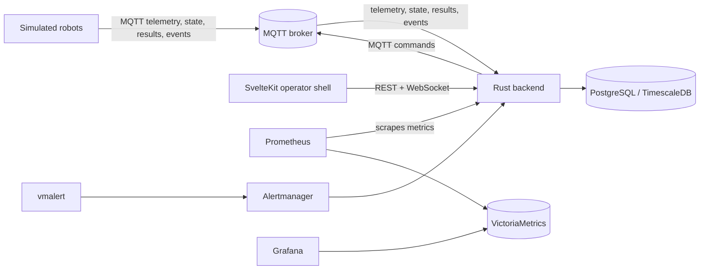
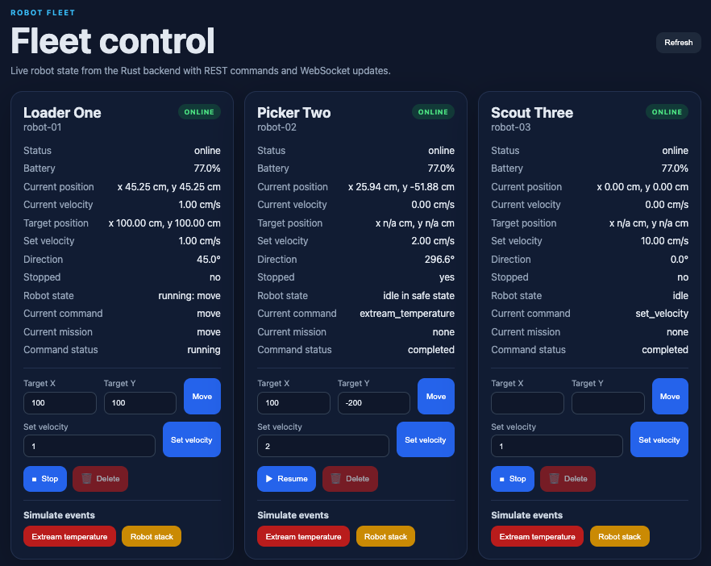
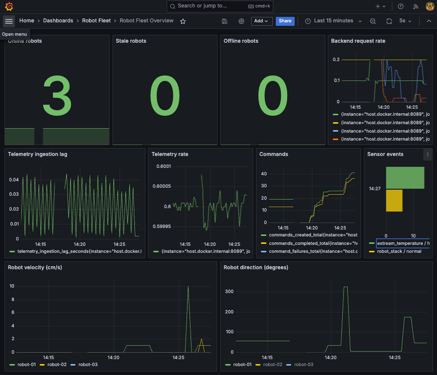
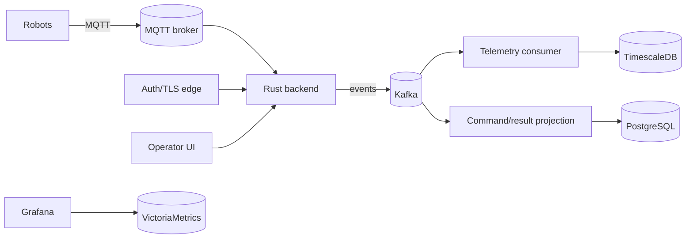
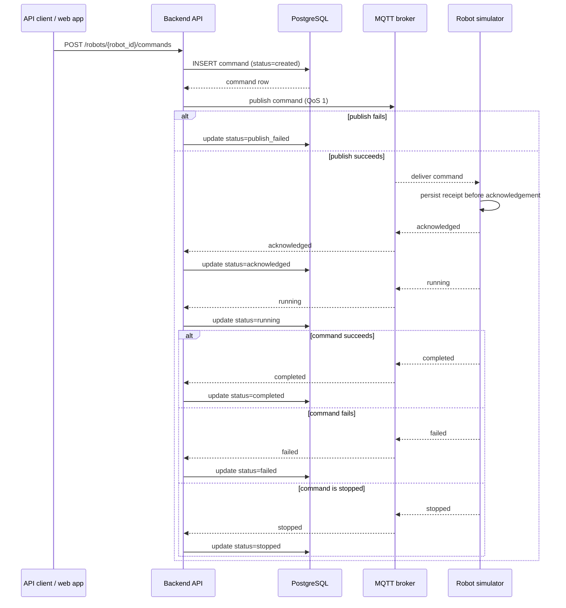

# Robot Fleet

Robot Fleet is a prototype that demonstrates the control loop of a robot fleet platform: an operator issues a command, the backend persists it, MQTT delivers it to a robot, the robot records the receipt before acknowledgement, and the backend projects the outcome back into state and metrics.

What is implemented: a Rust backend, a SvelteKit operator shell, MQTT-connected robot simulators, PostgreSQL plus TimescaleDB persistence, Prometheus/VictoriaMetrics/Grafana/Alertmanager observability, command lifecycle tracking, and last-seen-based robot status.

What is excluded on purpose: authentication, TLS, a production frontend, Kafka in the implemented path, realistic robot physics, and exactly-once execution claims.

Guarantees this prototype does make: commands are written before publish, robot receipts are idempotent, duplicate QoS 1 deliveries of operational commands do not execute twice, simulated events are deliberately untracked in the commands table, and readiness reflects the actual DB and MQTT dependencies.

Guarantees it does not make: end-to-end exactly-once delivery, lossless delivery across arbitrary crashes, or production-grade security and scaling.

## Architecture

### Current implemented architecture



The backend subscribes directly to MQTT topics, stores current state in PostgreSQL, keeps historical telemetry and state transitions in TimescaleDB hypertables, and publishes commands with unique IDs to robot command topics. The web app is an operator shell, not a full product UI.





### Production evolution



This shows a later production path, not the current implementation. Observability and alerting are already part of the stack; the remaining future work is mainly around scale-out, auth/TLS, and event-driven decomposition.

## Command lifecycle



Failure boundaries this prototype makes explicit:

- API database write succeeds but MQTT publish fails: the command is persisted as `publish_failed`, but no robot execution is claimed.
- Simulator persists the receipt and then crashes: the receipt survives restart, so a duplicate delivery does not re-execute the same command.
- QoS 1 duplicates: the broker may redeliver, but receipt tracking and command UUIDs make handling idempotent.
- Backend restart while results are in flight: the next result that arrives still updates the database, but the prototype does not claim exactly-once or in-order recovery across crashes.

## Architecture and trade-offs

| Decision | Why | Result here |
| --- | --- | --- |
| MQTT for robot connectivity | Simple robot-to-backend transport, good fit for intermittent connectivity and topic-based fanout | Commands, telemetry, state, and events move over MQTT |
| QoS differs by message type | Telemetry is high volume and can tolerate loss; commands and results need retry-friendly delivery | Telemetry uses QoS 0, command/state/result topics use QoS 1 |
| PostgreSQL for current state | Fast relational source of truth for live robot and command views | Current robot state and command lifecycle live in Postgres |
| TimescaleDB for history | Time-series retention and querying belong in a hypertable, not the live state row | Telemetry and state history are stored as time-series |
| Kafka omitted from the implemented path | It is a production evolution, not the smallest understandable prototype | Keeps the first implementation easy to run and reason about |
| Auth/TLS out of scope locally | Local learning setup should stay friction-light | No local login flow or certificate management yet |
| Frontend as demo/operator shell | The course needs a thin control surface, not a full product UI | The web app is intentionally minimal |
| Metrics and dashboards prioritized | Observability makes failure modes visible during the demo and in development | Grafana/VictoriaMetrics are first-class parts of the stack |
| No exactly-once claim | MQTT QoS 1 and process restarts still permit duplicates | UUIDs and idempotent writes are used instead |

## Repository structure

```text
backend/                 Rust Axum API, SQLx migrations, MQTT ingestion
robot-fleet-common/      Shared Rust domain types and helpers
web-app/                 SvelteKit fleet UI
robot-simulator/         Rust MQTT robot simulator
infrastructure/mqtt/     Mosquitto config
infrastructure/alertmanager/
infrastructure/prometheus/
infrastructure/vmalert/
infrastructure/grafana/  Provisioned datasource and dashboard
data/                    Persistent local Docker data
docker-compose.yml       Local platform
Makefile                 Developer commands
.env.example             Example configuration
```

## Prerequisites

- Docker and Docker Compose
- Rust stable
- `cargo install sqlx-cli --no-default-features --features postgres` for `make db-migrate`

## Local debug workflow

Start infrastructure:

```sh
make infra-up
```

Run the backend locally:

```sh
make backend-run
```

Run one simulator locally:

```sh
make robot-run ROBOT_ID=robot-local ROBOT_NAME="Local Robot"
```

Run the web app locally:

```sh
cd web-app && npm install
make web-run
```

Prometheus scrapes the local backend at `host.docker.internal:8089` and one local simulator at `host.docker.internal:9100`, then remote-writes metrics to VictoriaMetrics. Grafana queries VictoriaMetrics through its Prometheus-compatible API. vmalert evaluates alert rules against VictoriaMetrics and forwards notifications to Alertmanager.

For local simulator runs, processed command records are stored in `data/robots/<ROBOT_ID>/processed_commands.json`. Docker simulators store the same idempotency state under their mounted `/state` volume.

`ROBOT_ID` is the logical robot identity used in topics and payloads. The simulator uses a separate MQTT client ID, generated per process by default, so multiple local simulator processes do not take over each other's broker sessions. Set `MQTT_CLIENT_ID` only when you need a specific MQTT client identity.

`make dev` starts Docker infrastructure and then runs the backend locally in the foreground. Start the web app and local robot simulators in separate terminals.

Use `make backend-stop-dev`, `make web-stop-dev`, `make robots-stop-dev`, or `make stop-dev` to stop the corresponding local dev processes.

`make db-migrate` starts `postgres-timescaledb` if needed, waits for it to become ready, and then runs SQLx migrations against the local database port.

## Docker Compose workflow

Start the full platform with three robot simulators:

```sh
make docker-up
```

Inspect logs:

```sh
make docker-logs
```

Stop it:

```sh
make docker-down
```

Stateful container data, including PostgreSQL tables, is stored in `data/` on the host and survives container restarts:

- `data/postgres/`
- `data/mqtt/`
- `data/victoriametrics/`
- `data/grafana/`
- `data/robots/robot-01/`
- `data/robots/robot-02/`
- `data/robots/robot-03/`

Each robot directory contains `processed_commands.json`, a single pretty-printed JSON object keyed by command UUID with the latest lifecycle metadata for each operational command. Writes are serialized within each simulator process. Simulated events are deliberately untracked.

## Service URLs

```text
Backend:        http://localhost:8089
Web app:        http://localhost:3001  (Docker) or http://localhost:5173 (local dev)
Grafana:        http://localhost:3000  admin/admin
Prometheus:     http://localhost:9090
Alertmanager:    http://localhost:9093
vmalert:        http://localhost:8880
VictoriaMetrics: http://localhost:8428
MQTT:           localhost:1883
PostgreSQL:     localhost:5432
```

## API examples

```sh
curl http://localhost:8089/health
curl http://localhost:8089/health/live
curl http://localhost:8089/health/ready
curl http://localhost:8089/robots
curl http://localhost:8089/robots/robot-01
websocket ws://localhost:8089/robots/stream
curl http://localhost:8089/robots/robot-01/commands
curl -X POST http://localhost:8089/robots/robot-01/commands \
  -H 'content-type: application/json' \
  -d '{"command_type":"move","payload":{"target_position":{"x":100,"y":50}}}'
```

The backend assigns every command a unique `command_id`. Robots persist status-aware command records before acknowledging, so repeated MQTT deliveries of the same operational command are acknowledged but not executed again.

Command creation now requires the target robot to exist and not be offline, and the backend assigns a default expiry when `expires_at` is omitted so commands do not remain pending forever.

`GET /health` and `GET /health/live` are liveness checks. `GET /health/ready` is the readiness check used by Docker Compose and returns success only when PostgreSQL and MQTT are reachable.

Robot status in `GET /robots` and `GET /robots/{robot_id}` is computed from `last_seen_at`: `online` when the backend saw telemetry or state within 5 seconds, `stale` between 5 and 15 seconds, and `offline` after 15 seconds.

The web app reads `GET /robots` for the initial snapshot and then listens to `GET /robots/stream` as a WebSocket for live robot updates. It sends `move`, `set_velocity`, and `stop` commands through `POST /robots/{robot_id}/commands`, and sends `extreme_temperature` and `robot_stack` as simulated events through `POST /robots/{robot_id}/simulated-events`. Offline robots can be deleted through `DELETE /robots/{robot_id}`.

## MQTT topics

```text
robots/{robot_id}/telemetry          QoS 0
robots/{robot_id}/state              QoS 1
robots/{robot_id}/events             QoS 1 normal-priority sensor events
robots/{robot_id}/events/high-priority QoS 1 high-priority sensor events
robots/{robot_id}/commands           QoS 1
robots/{robot_id}/simulated-events    QoS 1 simulated event requests
robots/{robot_id}/command-results     QoS 1
```

```text
POST /robots/{robot_id}/commands
POST /robots/{robot_id}/simulated-events
```

Command messages sent by the backend to `robots/{robot_id}/commands` include the backend-generated ID:

```json
{
  "command_id": "uuid",
  "robot_id": "robot-01",
  "command_type": "move",
  "payload": { "target_position": { "x": 100, "y": 50 } },
  "expires_at": "2026-07-30T10:05:55Z"
}
```

Simulator command lifecycle states are published to `robots/{robot_id}/command-results` as `acknowledged`, `running`, `completed`, `failed`, `expired`, or `stopped`. `move` runs until the robot reaches the target at the current `set_velocity`; a later `move` overrides the active move and marks the prior move `stopped`. `set_velocity` can run while a move is active and immediately changes the operating velocity used by that move. `stop` with `true` pauses motion and reports the active move as `stopped`; `stop` with `false` resumes toward the last target position using the current set velocity.

The simulator also accepts `extreme_temperature` and `robot_stack` event simulation requests on `robots/{robot_id}/simulated-events` and the legacy `robots/{robot_id}/commands/high-priority` topic. `extreme_temperature` publishes the resulting sensor event to `robots/{robot_id}/events/high-priority`, which the backend subscribes to separately; `robot_stack` publishes to the normal `robots/{robot_id}/events` topic. Both stop the active move, run the internal `get_to_safe_state` safe-state command, publish robot state as `idle in safe state`, and emit a sensor event metric (`robot_sensor_events_total`) consumed by the Grafana dashboard and vmalert rules. After the safe-state sequence, `stop` with `false` resumes the interrupted move. These simulated events are handled separately, are not written to `processed_commands.json`, and are not stored as commands in PostgreSQL.

## Configuration

Copy `.env.example` to `.env` for local overrides. Main variables:

```text
DATABASE_URL
MQTT_URL
RUST_LOG
HTTP_PORT
ROBOT_ID
ROBOT_NAME
MQTT_CLIENT_ID
TELEMETRY_INTERVAL_SECONDS
METRICS_PORT
PROCESSED_COMMANDS_PATH
WEB_PORT
PUBLIC_BACKEND_HTTP_URL
PUBLIC_BACKEND_WS_URL
```

## Testing and operability

### What the tests cover

- Backend route unit tests cover health and readiness behavior, command validation, and the robot-command payload shape.
- Database unit tests cover robot status derivation from `last_seen_at`, command-result projection into robot state, and duplicate state-history suppression.
- `backend/src/mqtt.rs` has a real-PostgreSQL integration test that runs migrations, applies `acknowledged -> running -> completed`, and ignores duplicate command-result delivery when `DATABASE_URL` is set. Without `DATABASE_URL`, it exits successfully without exercising PostgreSQL.
- On simulator startup, any unfinished processed command is marked failed and published with reason `simulator_restarted_before_completion` instead of being replayed.

### What remains untested

- Full Docker Compose end-to-end flows across backend, broker, simulator, and UI.
- Browser-level UI automation.
- TLS, auth, and other production hardening.
- Network-partition behavior beyond the idempotent persistence paths already covered.

### Quality gates

Run these directly:

```sh
cargo fmt --all --check
cargo clippy --workspace --all-targets --all-features -- -D warnings
cargo test --workspace -- --test-threads=1
cd web-app && npm run check
cd web-app && npm run build
```

The Makefile wrappers are:

```sh
make build
make test
make backend-test
make web-check
make web-build
```

### Presentation smoke-test script

```sh
#!/usr/bin/env sh
set -eu

robot_id=robot-01

curl -sf http://localhost:8089/health/live >/dev/null
curl -sf http://localhost:8089/health/ready >/dev/null

command_id=$(
  curl -s -X POST "http://localhost:8089/robots/$robot_id/commands" \
    -H 'content-type: application/json' \
    -d '{"command_type":"move","payload":{"target_position":{"x":100,"y":50}}}' \
  | python -c 'import json,sys; print(json.load(sys.stdin)["command_id"])'
)

echo "command_id=$command_id"
curl -s "http://localhost:8089/robots/$robot_id/commands"
curl -s "http://localhost:8089/robots/$robot_id"
curl -sf "http://localhost:8089/metrics" | grep -E 'robots_(online|stale|offline)|commands_(created|completed|expired_without_ack)|mqtt_connection_status'
```

### Demoing the important states

- Offline/stale transitions: stop one simulator with `make robot1-down`, wait 6 seconds for `stale`, then wait 10 more seconds for `offline`.
- Duplicate commands: publish the same command payload and `command_id` twice; the second delivery is acknowledged without re-execution.
- Command completion: issue a normal `move` or `set_velocity` command and watch `created -> acknowledged -> running -> completed` through `/robots/{robot_id}/commands`.
- Grafana metrics: open `http://localhost:3000` and use the dashboard, or query `GET /metrics` for the same counters and gauges.

### Status vocabulary

| Check | Means | Depends on |
| --- | --- | --- |
| `GET /health/live` | The backend process is alive | Nothing external |
| `GET /health/ready` | The backend can actually serve the platform | PostgreSQL and MQTT |
| `robots[].status` | The backend last saw robot traffic recently enough to consider it online/stale/offline | `last_seen_at` in the database |

## Makefile commands

```text
make help
```
