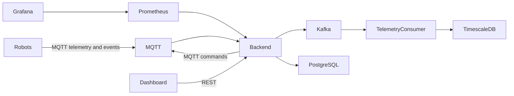

# Robot Fleet

Robot Fleet is a small learning project for building a robot fleet-management platform one piece at a time. It includes a Rust backend, simulated robots, MQTT, Kafka, PostgreSQL with TimescaleDB, Prometheus, Grafana, Docker Compose, and a Makefile.

The first version intentionally favors readability over production completeness.

## Architecture



Current implementation: the backend subscribes to robot MQTT telemetry/state/result topics, stores current robot state in PostgreSQL, stores historical telemetry in a TimescaleDB hypertable, exposes REST APIs, and publishes commands to robot MQTT command topics. Kafka is included and represented by a backend publishing hook; direct Kafka producer integration is a planned next step.

## Repository structure

```text
backend/                 Rust Axum API, SQLx migrations, MQTT ingestion
robot-simulator/         Rust MQTT robot simulator
infrastructure/mqtt/     Mosquitto config
infrastructure/prometheus/
infrastructure/grafana/  Provisioned datasource and dashboard
docker-compose.yml       Local platform
Makefile                 Developer commands
.env.example             Example configuration
```

## Prerequisites

- Docker and Docker Compose
- Rust stable
- `cargo install sqlx-cli --no-default-features --features postgres` for `make db-migrate`

## Local debug workflow

Start infrastructure:

```sh
make infra-up
```

Run the backend locally:

```sh
make backend-run
```

Run one simulator locally:

```sh
make robot-run ROBOT_ID=robot-local ROBOT_NAME="Local Robot"
```

`make dev` starts Docker infrastructure and then runs the backend locally in the foreground. Start local robot simulators in separate terminals.

## Docker Compose workflow

Start the full platform with three robot simulators:

```sh
make docker-up
```

Inspect logs:

```sh
make docker-logs
```

Stop it:

```sh
make docker-down
```

## Makefile commands

```text
make help
make infra-up
make infra-down
make infra-logs
make db-migrate
make backend-run
make backend-test
make robot-run ROBOT_ID=robot-local
make dev
make build
make test
make docker-build
make docker-up
make docker-down
make docker-logs
make clean
```

## Service URLs

```text
Backend:    http://localhost:8080
Grafana:    http://localhost:3000  admin/admin
Prometheus: http://localhost:9090
MQTT:       localhost:1883
PostgreSQL: localhost:5432
Kafka:      localhost:9092
```

## API examples

```sh
curl http://localhost:8080/health
curl http://localhost:8080/robots
curl http://localhost:8080/robots/robot-01
curl http://localhost:8080/robots/robot-01/commands
curl -X POST http://localhost:8080/robots/robot-01/commands \
  -H 'content-type: application/json' \
  -d '{"command_type":"dock","payload":{"station":"A"}}'
```

## MQTT topics

```text
robots/{robot_id}/telemetry       QoS 0
robots/{robot_id}/state           QoS 1
robots/{robot_id}/events          reserved
robots/{robot_id}/commands        QoS 1
robots/{robot_id}/command-results QoS 1
```

## Configuration

Copy `.env.example` to `.env` for local overrides. Main variables:

```text
DATABASE_URL
MQTT_URL
KAFKA_BROKERS
RUST_LOG
HTTP_PORT
ROBOT_ID
ROBOT_NAME
TELEMETRY_INTERVAL_SECONDS
METRICS_PORT
```

## Current limitations

- No authentication, authorization, TLS, or production hardening.
- Kafka is provisioned and documented, but backend Kafka publishing is currently a logging placeholder.
- Command delivery is at-least-once through MQTT with duplicate command suppression in each simulator.
- The simulator uses simple random movement rather than realistic robot physics.
- Grafana dashboard is intentionally minimal.

## Planned course extensions

- Real Kafka producer/consumer flow after MQTT ingestion.
- Dedicated telemetry consumers and richer TimescaleDB queries.
- Command expiry and retries.
- Observability improvements and alerting.
- Emergency event handling.
- A small dashboard frontend.
