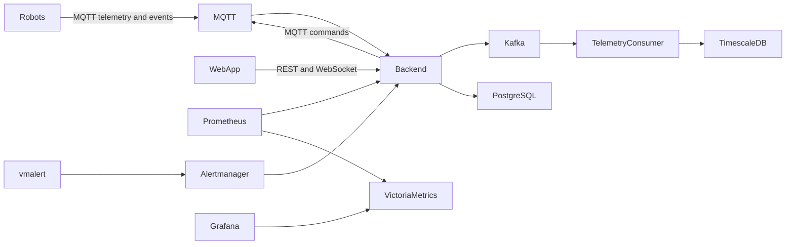

# Robot Fleet

Robot Fleet is a small learning project for building a robot fleet-management platform one piece at a time. It includes a Rust backend, a SvelteKit web app, simulated robots, MQTT, Kafka, PostgreSQL with TimescaleDB, Prometheus, VictoriaMetrics, Grafana, Docker Compose, and a Makefile.

The first version intentionally favors readability over production completeness.

## Architecture



Current implementation: the backend subscribes to robot MQTT telemetry/state/result/event topics, stores current robot state in PostgreSQL, stores historical telemetry and robot state transitions in TimescaleDB hypertables, exposes REST and WebSocket APIs, and publishes commands with unique IDs to robot MQTT command topics. The SvelteKit web app shows live robot cards with position, set velocity, current velocity, direction, and operating state, and sends commands through the backend. vmalert evaluates robot sensor events and sends `extream_temperature` and `robot_stack` alerts through Alertmanager to the backend webhook.


Robot status is derived from when the backend last saw telemetry or state: `online` within 5 seconds, `stale` from 5 to 15 seconds, and `offline` after 15 seconds. Each simulator persists command IDs before acknowledgement for idempotency, reports every command lifecycle state over MQTT, executes motion independently from MQTT command intake, and can simulate sensor incidents. Kafka is included and represented by a backend publishing hook; direct Kafka producer integration is a planned next step. Grafana includes per-robot motion metrics for velocity/direction and bar charts for simulated sensor events.


## Repository structure

```text
backend/                 Rust Axum API, SQLx migrations, MQTT ingestion
robot-fleet-common/      Shared Rust domain types and helpers
web-app/                 SvelteKit fleet UI
robot-simulator/         Rust MQTT robot simulator
infrastructure/mqtt/     Mosquitto config
infrastructure/alertmanager/
infrastructure/prometheus/
infrastructure/vmalert/
infrastructure/grafana/  Provisioned datasource and dashboard
data/                    Persistent local Docker data
docker-compose.yml       Local platform
Makefile                 Developer commands
.env.example             Example configuration
```

## Prerequisites

- Docker and Docker Compose
- Rust stable
- `cargo install sqlx-cli --no-default-features --features postgres` for `make db-migrate`

## Local debug workflow

Start infrastructure:

```sh
make infra-up
```

Run the backend locally:

```sh
make backend-run
```

Run one simulator locally:

```sh
make robot-run ROBOT_ID=robot-local ROBOT_NAME="Local Robot"
```

Run the web app locally:

```sh
cd web-app && npm install
make web-run
```

Prometheus scrapes the local backend at `host.docker.internal:8089` and one local simulator at `host.docker.internal:9100`, then remote-writes metrics to VictoriaMetrics. Grafana queries VictoriaMetrics through its Prometheus-compatible API. vmalert evaluates alert rules against VictoriaMetrics and forwards notifications to Alertmanager.

For local simulator runs, processed command IDs are stored in `data/robots/<ROBOT_ID>/processed_commands.txt`. Docker simulators store the same idempotency state under their mounted `/state` volume.

`ROBOT_ID` is the logical robot identity used in topics and payloads. The simulator uses a separate MQTT client ID, generated per process by default, so multiple local simulator processes do not take over each other's broker sessions. Set `MQTT_CLIENT_ID` only when you need a specific MQTT client identity.

`make dev` starts Docker infrastructure and then runs the backend locally in the foreground. Start the web app and local robot simulators in separate terminals.

Use `make backend-stop-dev`, `make web-stop-dev`, `make robots-stop-dev`, or `make stop-dev` to stop the corresponding local dev processes.

`make db-migrate` starts `postgres-timescaledb` if needed, waits for it to become ready, and then runs SQLx migrations against the local database port.

## Docker Compose workflow

Start the full platform with three robot simulators:

```sh
make docker-up
```

Inspect logs:

```sh
make docker-logs
```

Stop it:

```sh
make docker-down
```

Stateful container data is stored in `data/` on the host:

- `data/postgres/`
- `data/mqtt/`
- `data/kafka/`
- `data/victoriametrics/`
- `data/grafana/`
- `data/robots/robot-01/`
- `data/robots/robot-02/`
- `data/robots/robot-03/`

Each robot directory contains `processed_commands.txt`, which stores command UUIDs the simulator has already handled. This makes command handling idempotent across duplicate MQTT deliveries and simulator restarts.

## Makefile commands

```text
make help
```

## Service URLs

```text
Backend:    http://localhost:8089
Web app:    http://localhost:3001  (Docker) or http://localhost:5173 (local dev)
Grafana:    http://localhost:3000  admin/admin
Prometheus: http://localhost:9090
Alertmanager: http://localhost:9093
vmalert:    http://localhost:8880
VictoriaMetrics: http://localhost:8428
MQTT:       localhost:1883
PostgreSQL: localhost:5432
Kafka:      localhost:9092
```

## API examples

```sh
curl http://localhost:8089/health
curl http://localhost:8089/robots
curl http://localhost:8089/robots/robot-01
websocket ws://localhost:8089/robots/stream
curl http://localhost:8089/robots/robot-01/commands
curl -X POST http://localhost:8089/robots/robot-01/commands \
  -H 'content-type: application/json' \
  -d '{"command_type":"move","payload":{"target_position":{"x":100,"y":50}}}'
```

The backend assigns every command a unique `command_id`. Robots persist command IDs before publishing `acknowledged`, so repeated MQTT deliveries of the same command are acknowledged but not executed again.

Robot status in `GET /robots` and `GET /robots/{robot_id}` is computed from `last_seen_at`: `online` when the backend saw telemetry or state within 5 seconds, `stale` between 5 and 15 seconds, and `offline` after 15 seconds.

The web app reads `GET /robots` for the initial snapshot and then listens to `GET /robots/stream` as a WebSocket for live robot updates. It sends `move`, `set_velocity`, `stop`, `extream_temperature`, and `robot_stack` commands through `POST /robots/{robot_id}/commands`. Offline robots can be deleted through `DELETE /robots/{robot_id}`.

## MQTT topics

```text
robots/{robot_id}/telemetry       QoS 0
robots/{robot_id}/state           QoS 1
robots/{robot_id}/events          QoS 1 normal-priority sensor events
robots/{robot_id}/events/high-priority QoS 1 high-priority sensor events
robots/{robot_id}/commands        QoS 1
robots/{robot_id}/simulated-events QoS 1 command-initiated simulator event requests
robots/{robot_id}/command-results QoS 1
```

Command messages sent by the backend to `robots/{robot_id}/commands` include the backend-generated ID:

```json
{
  "command_id": "uuid",
  "robot_id": "robot-01",
  "command_type": "move",
  "payload": { "target_position": { "x": 100, "y": 50 } },
  "expires_at": "2026-07-30T10:05:55Z"
}
```

Simulator command lifecycle states are published to `robots/{robot_id}/command-results` as `acknowledged`, `running`, `completed`, `failed`, `expired`, or `stopped`. `move` runs until the robot reaches the target at the current `set_velocity`; a later `move` overrides the active move and marks the prior move `stopped`. `set_velocity` can run while a move is active and immediately changes the operating velocity used by that move. `stop` with `true` pauses motion and reports the active move as `stopped`; `stop` with `false` resumes toward the last target position using the current set velocity.

The simulator also accepts `extream_temperature` and `robot_stack` event simulation requests on `robots/{robot_id}/simulated-events` and the legacy `robots/{robot_id}/commands/high-priority` topic. `extream_temperature` publishes the resulting sensor event to `robots/{robot_id}/events/high-priority`, which the backend subscribes to separately; `robot_stack` publishes to the normal `robots/{robot_id}/events` topic. Both stop the active move, run the internal `get_to_save_state` safe-state command, publish robot state as `idle in safe state`, and emit a sensor event metric (`robot_sensor_events_total`) consumed by the Grafana dashboard and vmalert rules.

## Configuration

Copy `.env.example` to `.env` for local overrides. Main variables:

```text
DATABASE_URL
MQTT_URL
KAFKA_BROKERS
RUST_LOG
HTTP_PORT
ROBOT_ID
ROBOT_NAME
MQTT_CLIENT_ID
TELEMETRY_INTERVAL_SECONDS
METRICS_PORT
PROCESSED_COMMANDS_PATH
WEB_PORT
PUBLIC_BACKEND_HTTP_URL
PUBLIC_BACKEND_WS_URL
```

## Current limitations

- No authentication, authorization, TLS, or production hardening.
- Kafka is provisioned and documented, but backend Kafka publishing is currently a logging placeholder.
- Command delivery is at-least-once through MQTT with robot-side duplicate command suppression based on persisted unique command IDs.
- The simulator uses simple linear movement toward target positions rather than realistic robot physics.
- The web app is intentionally minimal and does not include authentication, route protection, or a map visualization.
- Grafana dashboard is intentionally minimal.

## Planned course extensions

- Real Kafka producer/consumer flow after MQTT ingestion.
- Dedicated telemetry consumers and richer TimescaleDB queries.
- Command expiry and retries.
- Observability improvements and alerting.
- Emergency event handling.
- Richer dashboard interactions and map visualization.
